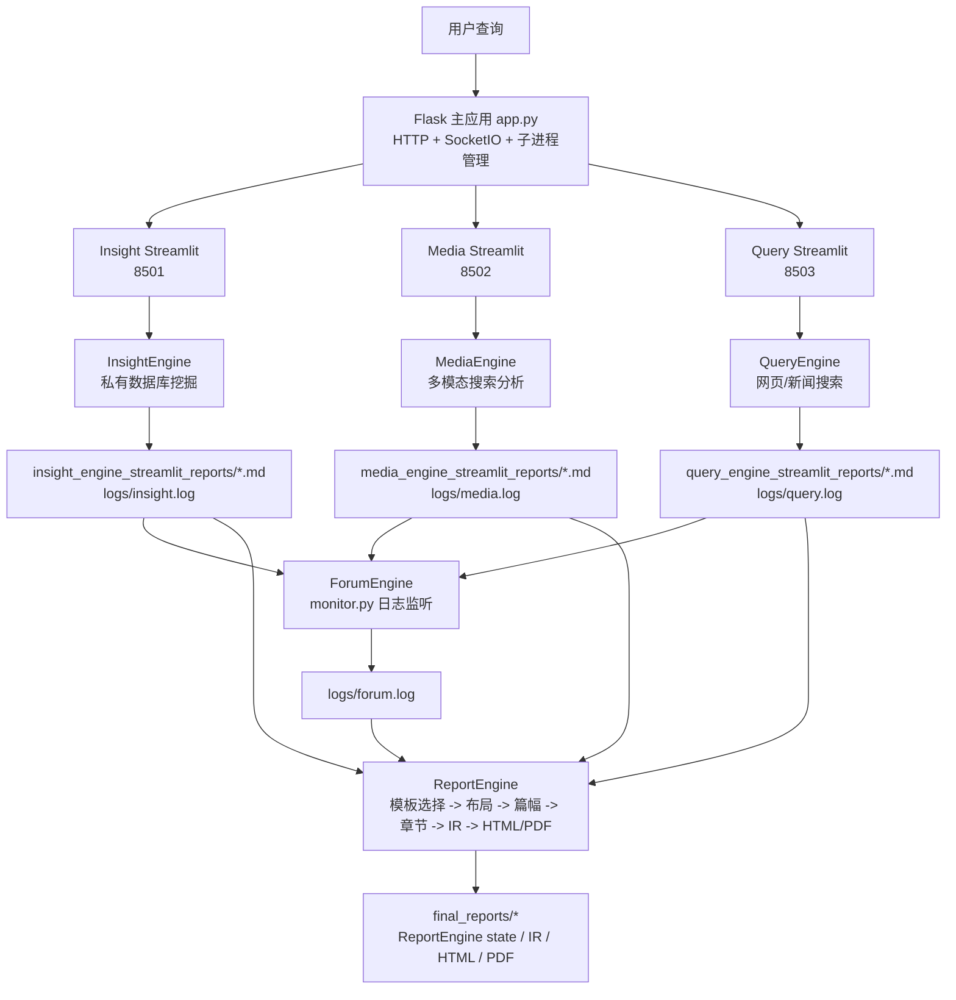
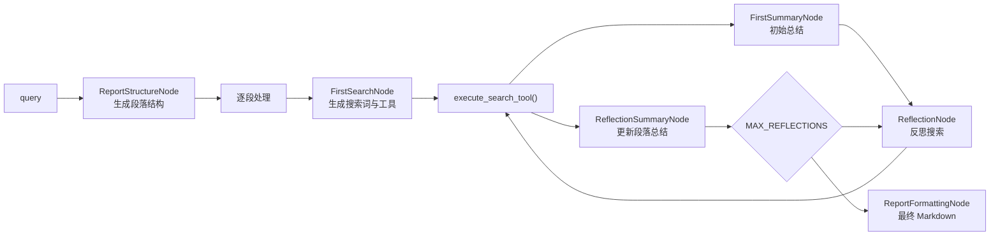
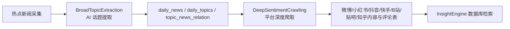

# BettaFish 项目系统说明文档

本文档基于当前仓库源码梳理，面向后续接手、部署、二次开发和问题定位。BettaFish（微舆）是一个多智能体舆情分析系统：用户提交自然语言查询后，系统并行调度私域数据库挖掘、多模态搜索、网页新闻搜索三个研究 Agent，并通过 ForumEngine 进行日志级协作讨论，最终由 ReportEngine 将多源研究结果生成结构化 HTML/PDF 报告。

## 1. 系统定位

BettaFish 的核心目标不是单一搜索或单次总结，而是把“数据采集、专题研究、协作辩论、报告生成”串成完整流水线：

- 通过 MindSpider 采集热点新闻、社媒内容、评论和互动数据，沉淀到数据库。
- 通过 InsightEngine 读取私有数据库，补充历史舆情、评论与情感倾向。
- 通过 MediaEngine 调用 Bocha 或 Anspire，多模态理解网页、图片、视频、结构化卡片等外部信息。
- 通过 QueryEngine 调用 Tavily，补充国内外新闻、网页和时效信息。
- 通过 ForumEngine 监听三个 Agent 的 SummaryNode 输出，生成主持人引导，形成多轮“论坛”讨论。
- 通过 ReportEngine 读取三引擎最新 Markdown 报告和 `logs/forum.log`，生成模板化、可交互的终稿。

## 2. 总体架构



## 3. 运行时主流程

1. 用户访问 `http://localhost:5000`，由 `app.py` 渲染 `templates/index.html`。
2. 前端调用 `/api/system/start`，`app.py` 执行 `initialize_system_components()`：
   - 初始化 MindSpider 数据库连接与表结构检查。
   - 启动三个 Streamlit 子应用：Insight 8501、Media 8502、Query 8503。
   - 启动 ForumEngine 日志监控线程。
   - 初始化 ReportEngine 并注册 `/api/report/*` 蓝图。
3. 用户提交查询到 `/api/search`，Flask 将同一查询转发给三个运行中的 Streamlit 应用 `/api/search`。
4. 三个 Agent 各自执行 `research()`：生成报告结构、逐段初搜、反思搜索、最终格式化，并保存 Markdown 报告。
5. ForumEngine 监控 `logs/insight.log`、`logs/media.log`、`logs/query.log`，捕获 `FirstSummaryNode` 和 `ReflectionSummaryNode` 的有效输出，写入 `logs/forum.log`；每累计 5 条 Agent 发言触发一次 Forum Host 发言。
6. 前端调用 `/api/report/generate` 后，ReportEngine 检查三引擎是否都有新报告文件，加载最新 Markdown 与论坛日志，后台线程生成最终报告。
7. ReportEngine 通过 SSE `/api/report/stream/<task_id>` 推送模板选择、布局、章节生成、重试、HTML 完成等事件。
8. 终稿写入 `final_reports/`，中间 IR 和状态文件也会一起持久化，前端可预览或下载。

## 4. 目录与模块职责

| 路径 | 职责 |
| --- | --- |
| `app.py` | Flask 主入口，负责配置读写、系统启动/关停、Streamlit 子进程管理、SocketIO 推送、Forum 日志转发和统一搜索入口。 |
| `config.py` | 全局 Pydantic Settings，集中管理数据库、各 Engine LLM、搜索 API、反思次数、内容长度等配置。 |
| `SingleEngineApp/` | 三个独立 Streamlit 应用，每个应用包装对应 Engine，接收自动查询并展示研究过程和结果。 |
| `InsightEngine/` | 私有数据库舆情挖掘 Agent，查询 MindSpider 入库数据，并集成关键词优化、聚类采样和情感分析。 |
| `MediaEngine/` | 多模态搜索 Agent，按 `SEARCH_TOOL_TYPE` 调用 Bocha 或 Anspire。 |
| `QueryEngine/` | 网页/新闻搜索 Agent，调用 Tavily 工具集。 |
| `ForumEngine/` | 论坛协作引擎，监听三引擎日志，抽取总结节点输出，调用 Forum Host 生成讨论引导。 |
| `ReportEngine/` | 最终报告生成引擎，负责模板选择、章节规划、章节 JSON 生成、IR 装订、HTML/PDF 渲染和 SSE 接口。 |
| `MindSpider/` | 舆情爬虫与数据库初始化系统，分为热点话题提取和社媒深度爬取两阶段。 |
| `SentimentAnalysisModel/` | 情感分析和话题检测模型集合，包含 BERT、GPT-2、Qwen、传统 ML 等实现。 |
| `tests/` | 目前重点覆盖 ForumEngine 日志解析和 ReportEngine 清洗逻辑。 |
| `logs/` | 运行期日志目录，ForumEngine 和各 Engine 协作主要依赖这里的日志文件。 |
| `final_reports/` | ReportEngine 最终报告及状态文件输出目录。 |

## 5. Flask 主应用

`app.py` 是系统控制平面，负责把多个独立服务拼成一个可启动、可观察、可关闭的整体。

### 5.1 生命周期管理

- `initialize_system_components()`：完整系统启动入口，包含 MindSpider 数据库初始化、三个 Streamlit 子应用启动、ForumEngine 启动、ReportEngine 初始化。
- `start_streamlit_app()`：用 `subprocess.Popen` 启动 `streamlit run`，端口固定为 8501/8502/8503。
- `wait_for_app_startup()` 和 `check_app_status()`：通过 Streamlit healthcheck 判断子应用是否就绪。
- `cleanup_processes()` / `cleanup_processes_concurrent()`：停止子进程和 ForumEngine。
- `/api/system/start`、`/api/system/shutdown`、`/api/system/status`：系统级控制接口。

### 5.2 搜索与日志接口

- `/api/search`：检查运行中的子应用后，将查询转发给三个 Streamlit 应用的 `/api/search`。
- `/api/output/<app_name>`：读取各 Engine 的输出日志。
- `/api/forum/log`、`/api/forum/log/history`：读取论坛日志，支持增量位置。
- SocketIO 事件：用于前端实时显示 console output、forum message 和状态更新。

### 5.3 配置读写

`/api/config` 通过 `read_config_values()` 和 `write_config_values()` 读取/修改白名单配置项。注意当前实现会直接更新 `config.py` 中的值，因此生产环境建议优先使用 `.env` 和部署层配置，避免多人同时操作造成配置漂移。

## 6. 三个研究 Agent 的共同结构

InsightEngine、MediaEngine、QueryEngine 采用高度相似的内部流水线：



共同关键对象：

- `DeepSearchAgent`：Agent 主类，暴露 `research(query, save_report=True)`。
- `state/state.py`：保存段落、搜索历史、反思轮次、最终报告等状态。
- `nodes/`：封装 LLM 节点，包括结构生成、搜索决策、总结、反思、格式化。
- `tools/`：具体数据源工具。
- `llms/base.py`：OpenAI 兼容客户端。
- `prompts/prompts.py`：节点提示词。

## 7. InsightEngine

InsightEngine 面向私有舆情数据库，适合回答“历史舆情如何演化、评论中真实态度是什么、不同平台声量和情绪有什么差异”等问题。

### 7.1 数据工具

核心工具位于 `InsightEngine/tools/search.py`，由 `MediaCrawlerDB` 提供：

- `search_hot_content(time_period, limit)`：按热度检索热门内容。
- `search_topic_globally(topic, limit_per_table)`：跨平台全局话题搜索。
- `search_topic_by_date(topic, start_date, end_date, limit_per_table)`：按日期范围搜索。
- `get_comments_for_topic(topic, limit)`：拉取评论。
- `search_topic_on_platform(platform, topic, ...)`：指定平台精搜。

这些工具查询 MindSpider 入库的 Bilibili、抖音、快手、微博、小红书、知乎、贴吧以及 `daily_news` 等表。

### 7.2 增强能力

- `keyword_optimizer.py`：用独立 LLM 优化数据库检索关键词，降低自然语言查询与表内容之间的匹配损耗。
- `sentiment_analyzer.py`：集成多语言情感模型，可对评论/内容做正负中性分析。
- `agent.py` 中包含聚类与采样逻辑，减少海量搜索结果直接塞给 LLM 的噪声和上下文压力。

## 8. MediaEngine

MediaEngine 面向外部多模态信息源，强调搜索引擎返回的网页、图片、结构化卡片和新近内容。

### 8.1 工具选择

`MediaEngine/tools/search.py` 支持两类客户端：

- `BochaMultimodalSearch`：提供综合搜索、纯网页搜索、结构化数据搜索、24 小时内搜索、一周内搜索。
- `AnspireAISearch`：提供综合搜索、24 小时内搜索、一周内搜索。

`SingleEngineApp/media_engine_streamlit_app.py` 会根据 `SEARCH_TOOL_TYPE` 校验需要的 API Key：`BochaAPI` 需要 `BOCHA_WEB_SEARCH_API_KEY`，`AnspireAPI` 需要 `ANSPIRE_API_KEY`。

### 8.2 与 QueryEngine 的边界

MediaEngine 更偏“多模态与结构化信息”，例如视频图文传播、天气/股票/日历等卡片；QueryEngine 更偏“新闻和网页事实检索”。两者都搜索外部公开信息，但提示词、工具参数和结果结构不同。

## 9. QueryEngine

QueryEngine 使用 `TavilyNewsAgency` 进行网页和新闻搜索，适合补充官方报道、国际视角和时效信息。

工具位于 `QueryEngine/tools/search.py`：

- `basic_search_news(query, max_results=7)`：快速通用新闻搜索。
- `deep_search_news(query)`：高级深度搜索。
- `search_news_last_24_hours(query)`：最近 24 小时。
- `search_news_last_week(query)`：最近一周。
- `search_images_for_news(query)`：新闻图片。
- `search_news_by_date(query, start_date, end_date)`：日期范围搜索。

Agent 会校验日期格式，工具缺参或日期非法时回退到基础搜索。

## 10. ForumEngine

ForumEngine 是协作层，不直接参与搜索，而是通过日志把三个独立 Agent 的阶段性结论组织成“讨论”。

### 10.1 日志监听机制

`ForumEngine/monitor.py` 的 `LogMonitor` 每秒检查：

- `logs/insight.log`
- `logs/media.log`
- `logs/query.log`

它识别 `FirstSummaryNode`、`ReflectionSummaryNode`、`nodes.summary_node` 以及中文标识“正在生成首次段落总结”“正在生成反思总结”。同时它会过滤 ERROR 块、无价值短日志和 JSON 解析失败信息，尽量只写入总结正文。

### 10.2 论坛日志格式

ForumEngine 写入 `logs/forum.log`，格式为：

```text
[HH:MM:SS] [INSIGHT] 内容
[HH:MM:SS] [MEDIA] 内容
[HH:MM:SS] [QUERY] 内容
[HH:MM:SS] [HOST] 主持人发言
```

内容中的实际换行会转义为 `\n`，方便一条发言保持在一行。`app.py` 的 `parse_forum_log_line()` 会把它重新解析为前端消息。

### 10.3 Forum Host

`ForumEngine/llm_host.py` 通过 OpenAI 兼容接口调用配置中的 Forum Host 模型。默认逻辑是每累计 5 条 Agent 发言触发一次主持人发言，主持人输出包括事件梳理、观点整合、趋势预测和后续问题引导。

## 11. ReportEngine

ReportEngine 是最终产物链路，核心入口有两个：

- `ReportEngine/flask_interface.py`：HTTP/SSE 任务接口。
- `ReportEngine/agent.py`：`ReportAgent.generate_report()` 生成主流程。

### 11.1 HTTP 与 SSE 接口

ReportEngine 蓝图注册到 Flask 的 `/api/report` 前缀下，主要接口：

- `GET /api/report/status`：检查 ReportEngine 初始化状态、三引擎输入文件是否齐备、当前任务。
- `POST /api/report/generate`：创建 `ReportTask`，后台线程执行生成，返回 `task_id` 和 `stream_url`。
- `GET /api/report/stream/<task_id>`：SSE 流式事件，支持 Last-Event-ID 断线补发和心跳。
- `GET /api/report/progress/<task_id>`：查询任务状态。
- `GET /api/report/result/<task_id>`：返回 HTML。
- `GET /api/report/result/<task_id>/json`：返回任务元数据和 HTML。
- `GET /api/report/download/<task_id>`：下载保存后的 HTML 文件。

`ReportTask` 维护 `pending/running/completed/error` 状态、进度、结果路径、最近 1000 条事件历史和 SSE 事件自增 ID。

### 11.2 生成主链路

`ReportAgent.generate_report()` 的阶段如下：

1. 归一化三引擎报告：默认顺序为 Query、Media、Insight，输出 `query_engine`、`media_engine`、`insight_engine` 三个字符串字段。
2. 模板选择：`TemplateSelectionNode` 根据查询、三份报告和论坛日志选择 `ReportEngine/report_template/` 下的 Markdown 模板；失败时回退到社会公共热点事件模板。
3. 模板切片：`parse_template_sections()` 将 Markdown 标题解析成 `TemplateSection` 列表。
4. 文档布局：`DocumentLayoutNode` 生成标题、hero、目录计划、主题样式等。
5. 篇幅规划：`WordBudgetNode` 为每章生成目标字数和写作约束。
6. 章节生成：`ChapterGenerationNode` 逐章调用 LLM，写入章节目录和 `stream.raw`，并推送 `chapter_chunk`。
7. 错误重试：对 JSON 解析失败、结构校验失败、内容密度不足、内容安全限制等进行重试；内容过稀时可能保留字数最多版本作为兜底。
8. IR 装订：`DocumentComposer.build_document()` 将章节 JSON 装订成 Document IR。
9. HTML 渲染：`HTMLRenderer.render()` 输出交互式 HTML。
10. 持久化：保存 HTML、IR、状态文件，并通过 SSE 推送路径和完成事件。

### 11.3 Document IR

ReportEngine 的中间表示位于 `ReportEngine/ir/`，大体结构为：

```text
Document IR
├── manifest      # 标题、副标题、模板、主题、目录、篇幅计划等全局元数据
├── chapters[]    # 章节数组
│   ├── chapterId
│   ├── title
│   ├── blocks[]  # heading / paragraph / image / chart / table / quote 等块
│   └── meta
└── meta
```

IR 的价值是把“LLM 生成内容”和“前端渲染样式”解耦，后续要扩展 PDF、Markdown、PPT 或其他展示端时，优先围绕 IR 扩展渲染器。

## 12. MindSpider

MindSpider 是数据底座，负责把外部社媒和热点新闻落库，供 InsightEngine 查询。

### 12.1 两阶段流程



### 12.2 数据库初始化

`MindSpider/main.py` 的 `MindSpider` 类负责：

- 根据 `DB_DIALECT` 构造 PostgreSQL 或 MySQL 异步连接。
- 测试数据库连接。
- 检查并初始化核心表。
- 通过 CLI 参数运行 `--setup`、`--broad-topic`、`--deep-sentiment`、`--complete` 等流程。

`MindSpider/schema/` 包含：

- `models_sa.py`：`DailyNews`、`DailyTopic`、`TopicNewsRelation`、`CrawlingTask` 等业务表。
- `models_bigdata.py`：各平台内容、评论、创作者等大表模型，共用同一个 SQLAlchemy `Base.metadata`。
- `init_database.py`：异步建表入口。
- `mindspider_tables.sql`：SQL 表结构参考。

## 13. 配置体系

根目录 `config.py` 使用 `pydantic-settings` 从 `.env` 加载配置。关键配置分组：

| 分组 | 典型字段 |
| --- | --- |
| Web 服务 | `HOST`、`PORT` |
| 数据库 | `DB_DIALECT`、`DB_HOST`、`DB_PORT`、`DB_USER`、`DB_PASSWORD`、`DB_NAME`、`DB_CHARSET` |
| LLM | `INSIGHT_ENGINE_*`、`MEDIA_ENGINE_*`、`QUERY_ENGINE_*`、`REPORT_ENGINE_*`、`FORUM_HOST_*`、`KEYWORD_OPTIMIZER_*` |
| 搜索 API | `TAVILY_API_KEY`、`SEARCH_TOOL_TYPE`、`BOCHA_*`、`ANSPIRE_*` |
| 搜索/生成限制 | `DEFAULT_*_LIMIT`、`MAX_SEARCH_RESULTS_FOR_LLM`、`MAX_REFLECTIONS`、`MAX_CONTENT_LENGTH`、`SEARCH_TIMEOUT` |

所有 LLM 都按 OpenAI 兼容接口封装，因此更换模型通常只需要调整 API Key、Base URL 和模型名。

## 14. 运行与部署

### 14.1 本地启动

```bash
python app.py
```

访问：

```text
http://localhost:5000
```

### 14.2 单独启动 Agent

```bash
streamlit run SingleEngineApp/insight_engine_streamlit_app.py --server.port 8501
streamlit run SingleEngineApp/media_engine_streamlit_app.py --server.port 8502
streamlit run SingleEngineApp/query_engine_streamlit_app.py --server.port 8503
```

### 14.3 MindSpider

```bash
cd MindSpider
python main.py --setup
python main.py --broad-topic
python main.py --complete --date 2024-01-20
```

### 14.4 ReportEngine CLI

```bash
python report_engine_only.py --query "土木工程行业分析"
python report_engine_only.py --skip-pdf
```

## 15. 测试与验证

当前测试重点：

- `tests/test_monitor.py`：ForumEngine 日志解析，覆盖旧格式 `[HH:MM:SS]` 和 loguru 新格式。
- `tests/test_report_engine_sanitization.py`：ReportEngine 输出清洗逻辑。

常用命令：

```bash
pytest tests/ -v
pytest tests/test_monitor.py -v
```

由于完整系统依赖外部 LLM、搜索 API、数据库和 Playwright，单元测试不能覆盖端到端生成质量。做集成验证时建议按以下顺序排查：

1. `.env` 配置是否齐备。
2. 数据库是否可连接，MindSpider 表是否初始化。
3. 三个 Streamlit 端口是否启动成功。
4. 三个报告目录是否产生新的 `.md` 文件。
5. `logs/forum.log` 是否捕获到三引擎发言。
6. `/api/report/status` 是否显示 engines_ready。
7. `/api/report/stream/<task_id>` 是否持续收到 SSE 事件。

## 16. 关键设计特征

- 多进程松耦合：Flask 负责统一入口，三个研究 Agent 通过 Streamlit 子进程独立运行，故障边界较清晰。
- 文件驱动集成：三引擎结果通过 Markdown 文件交给 ReportEngine，协作上下文通过 `forum.log` 传递，降低了模块间直接调用复杂度。
- 日志即协作协议：ForumEngine 不是侵入 Agent 内部状态，而是监听 SummaryNode 日志输出形成跨 Agent 讨论。
- 节点化 LLM 流程：搜索决策、总结、反思、格式化、模板选择、布局、篇幅、章节生成都以节点形式拆分，便于替换提示词和模型。
- IR 优先渲染：ReportEngine 先装订 Document IR，再渲染 HTML/PDF，适合扩展多种输出格式。
- 强依赖外部配置：LLM、搜索、数据库、爬虫都由配置决定，部署前配置完整性比代码改动更重要。

## 17. 维护注意事项

- 不要随意改变 `logs/*.log` 的格式。ForumEngine 对 SummaryNode 日志格式有正则依赖，格式变化需要同步更新 `tests/test_monitor.py`。
- 修改三引擎报告输出目录时，需要同步调整 ReportEngine 的 `FileCountBaseline` 和 `check_engines_ready()` 目录映射。
- 修改 ReportEngine 章节 JSON schema 时，需要同步更新 `ReportEngine/ir/validator.py`、`ChapterGenerationNode` 提示词和渲染器。
- 修改 `SEARCH_TOOL_TYPE` 后，要确认 MediaEngine 对应 API Key 存在，否则 Streamlit 应用会在启动研究前报错。
- ReportEngine 当前同一时间只允许一个运行中的生成任务，若要支持并发，需要重构全局 `current_task`、`report_agent` 和输出目录隔离策略。
- `app.py` 的配置更新接口会写入源码配置文件，团队协作或生产环境中建议限制该接口权限。
- 完整系统运行前应先确认 `playwright install chromium` 已执行，尤其是 MindSpider 深度爬取场景。

## 18. 推荐阅读顺序

如果要继续深入改造，建议按以下顺序读代码：

1. `app.py`：理解系统如何启动、转发查询、关闭和转发日志。
2. `SingleEngineApp/query_engine_streamlit_app.py`：理解单 Agent UI 如何触发研究。
3. `QueryEngine/agent.py`：用最轻的外部搜索 Agent 理解通用 `DeepSearchAgent` 流程。
4. `InsightEngine/agent.py` 与 `InsightEngine/tools/search.py`：理解数据库搜索和情感分析增强。
5. `ForumEngine/monitor.py`：理解日志协作协议。
6. `ReportEngine/flask_interface.py`：理解报告任务、SSE 和状态管理。
7. `ReportEngine/agent.py`：理解最终报告生成主链路。
8. `ReportEngine/core/`、`ReportEngine/ir/`、`ReportEngine/renderers/`：理解 IR 与渲染。
9. `MindSpider/main.py` 与 `MindSpider/schema/`：理解数据采集和数据库结构。

