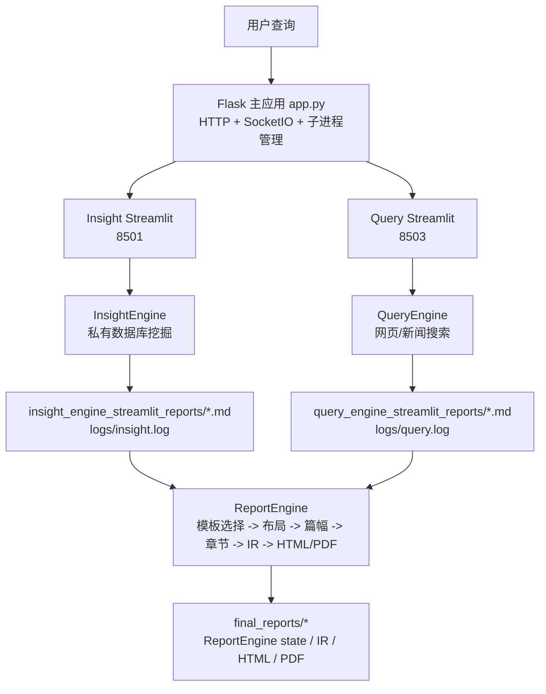
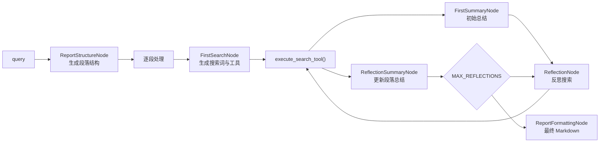
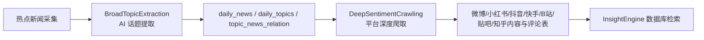

# BettaFish 项目系统说明文档

本文档基于当前仓库源码梳理，面向后续接手、部署、二次开发和问题定位。BettaFish（微舆）是一个多智能体舆情分析系统：用户提交自然语言查询后，系统并行调度私域数据库挖掘、多模态搜索、网页新闻搜索三个研究 Agent，由 ReportEngine 将多源研究结果生成结构化 HTML/PDF 报告。

当前版本基于 [BettaFish](https://github.com/666ghj/BettaFish) v1.2.1。

## 1. 系统定位

BettaFish 的核心目标不是单一搜索或单次总结，而是把"数据采集、专题研究、报告生成"串成完整流水线：

- 通过 MindSpider 采集热点新闻、社媒内容、评论和互动数据，沉淀到数据库。
- 通过 InsightEngine 读取私有数据库，补充历史舆情、评论与情感倾向。
- 通过 MediaEngine 调用 Bocha 或 Anspire，多模态理解网页、图片、视频、结构化卡片等外部信息。
- 通过 QueryEngine 调用 Tavily，补充国内外新闻、网页和时效信息。
- 通过 ReportEngine 读取三引擎最新 Markdown 报告，生成模板化、可交互的终稿。

## 2. 总体架构



## 3. 运行时主流程

1. 用户访问 `http://localhost:5000`，由 `app.py` 渲染 `templates/index.html`。
2. 前端调用 `/api/system/start`，`app.py` 执行 `initialize_system_components()`：
   - 初始化 MindSpider 数据库连接与表结构检查。
   - 启动两个 Streamlit 子应用：Insight 8501、Query 8503。
   - 初始化 ReportEngine 并注册 `/api/report/*` 蓝图。
3. 用户提交查询到 `/api/search`，Flask 将同一查询转发给两个运行中的 Streamlit 应用 `/api/search`。
4. 两个 Agent 各自执行 `research()`：生成报告结构、逐段初搜、反思搜索、最终格式化，并保存 Markdown 报告。
5. 前端调用 `/api/report/generate` 后，ReportEngine 检查引擎是否都有新报告文件，加载最新 Markdown，后台线程生成最终报告。
6. ReportEngine 通过 SSE `/api/report/stream/<task_id>` 推送模板选择、布局、章节生成、重试、HTML 完成等事件。
7. 终稿写入 `final_reports/`，中间 IR 和状态文件也会一起持久化，前端可预览或下载。

## 4. 目录与模块职责

| 路径 | 职责 |
| --- | --- |
| `app.py` | Flask 主入口，负责配置读写、系统启动/关停、Streamlit 子进程管理、SocketIO 推送和统一搜索入口。 |
| `config.py` | 全局 Pydantic Settings，集中管理数据库、各 Engine LLM、搜索 API、反思次数、内容长度等配置。 |
| `SingleEngineApp/` | 两个独立 Streamlit 应用，每个应用包装对应 Engine，接收自动查询并展示研究过程和结果。 |
| `InsightEngine/` | 私有数据库舆情挖掘 Agent，查询 MindSpider 入库数据，并集成关键词优化、聚类采样和情感分析。 |
| `MediaEngine/` | 多模态搜索 Agent，按 `SEARCH_TOOL_TYPE` 调用 Bocha 或 Anspire。（当前已禁用） |
| `QueryEngine/` | 网页/新闻搜索 Agent，调用 Tavily 工具集。 |
| `ReportEngine/` | 最终报告生成引擎，负责模板选择、章节规划、章节 JSON 生成、IR 装订、HTML/PDF 渲染和 SSE 接口。包含 `core/`、`ir/`、`nodes/`、`renderers/`、`utils/` 子模块。 |
| `MindSpider/` | 舆情爬虫与数据库初始化系统，分为热点话题提取和社媒深度爬取两阶段。 |
| `SentimentAnalysisModel/` | 情感分析和话题检测模型集合，包含 BERT、GPT-2、Qwen、传统 ML 等实现。 |
| `utils/` | 通用工具模块：`retry_helper.py`（带指数退避的重试装饰器）、`github_issues.py`（GitHub Issues 交互）。 |
| `tests/` | 目前覆盖 ReportEngine 清洗逻辑。 |
| `logs/` | 运行期日志目录。 |
| `final_reports/` | ReportEngine 最终报告及状态文件输出目录。 |
| `static/` | 静态资源，包含 `Switch/js/` 前端 JS、`v2_report_example/` 报告样例。 |
| `templates/` | `index.html`（约 5.4MB，含前端单页应用）。 |

### 独立脚本

| 脚本 | 用途 |
| --- | --- |
| `report_engine_only.py` | 独立报告生成 CLI，无需 Flask 和 Streamlit 子进程，直接读取已有报告文件生成 HTML/PDF。 |
| `export_pdf.py` | 将已有 HTML 报告导出为 PDF。 |
| `regenerate_latest_html.py` | 从最新 IR 文件重新生成 HTML。 |
| `regenerate_latest_md.py` | 从最新 IR 文件重新生成 Markdown。 |
| `regenerate_latest_pdf.py` | 从最新 IR 文件重新生成 PDF。 |

## 5. Flask 主应用

`app.py` 是系统控制平面，负责把多个独立服务拼成一个可启动、可观察、可关闭的整体。

### 5.1 生命周期管理

- `initialize_system_components()`：完整系统启动入口，包含 MindSpider 数据库初始化、两个 Streamlit 子应用启动、ReportEngine 初始化。
- `start_streamlit_app()`：用 `subprocess.Popen` 启动 `streamlit run`，端口固定为 8501/8503。
- `wait_for_app_startup()` 和 `check_app_status()`：通过 Streamlit healthcheck 判断子应用是否就绪。
- `cleanup_processes()` / `cleanup_processes_concurrent()`：停止子进程。
- `/api/system/start`、`/api/system/shutdown`、`/api/system/status`：系统级控制接口。

### 5.2 搜索与日志接口

- `/api/search`：检查运行中的子应用后，将查询转发给运行中 Streamlit 应用的 `/api/search`。
- `/api/output/<app_name>`：读取各 Engine 的输出日志。
- SocketIO 事件：用于前端实时显示 console output 和状态更新。

### 5.3 配置读写

`/api/config` 通过 `read_config_values()` 和 `write_config_values()` 读取/修改白名单配置项。注意当前实现会直接更新 `config.py` 中的值，因此生产环境建议优先使用 `.env` 和部署层配置，避免多人同时操作造成配置漂移。

### 5.4 ReportEngine 蓝图

ReportEngine 通过 Flask Blueprint 注册到 `/api/report` 前缀，SSE 事件流通过 Flask 路由而非 SocketIO 实现。

## 6. 三个研究 Agent 的共同结构

InsightEngine、MediaEngine、QueryEngine 采用高度相似的内部流水线：



共同关键对象：

- `DeepSearchAgent`：Agent 主类，暴露 `research(query, save_report=True)`。
- `state/state.py`：保存段落、搜索历史、反思轮次、最终报告等状态。
- `nodes/`：封装 LLM 节点，包括结构生成、搜索决策、总结、反思、格式化。
- `tools/`：具体数据源工具。
- `llms/base.py`：OpenAI 兼容客户端。
- `prompts/prompts.py`：节点提示词。

### 二次开发参考：节点模式

每个节点是一个独立的 LLM 调用类，继承自基类节点，实现 `run()` 方法返回结构化输出。Agent 通过 `mutate_state()` 将节点输出写回状态。新增功能时，只需新增节点类并编排到 Agent 流水线中，无需改动现有节点。

## 7. InsightEngine

InsightEngine 面向私有舆情数据库，适合回答"历史舆情如何演化、评论中真实态度是什么、不同平台声量和情绪有什么差异"等问题。

### 7.1 数据工具

核心工具位于 `InsightEngine/tools/search.py`，由 `MediaCrawlerDB` 提供：

- `search_hot_content(time_period, limit)`：按热度检索热门内容。
- `search_topic_globally(topic, limit_per_table)`：跨平台全局话题搜索。
- `search_topic_by_date(topic, start_date, end_date, limit_per_table)`：按日期范围搜索。
- `get_comments_for_topic(topic, limit)`：拉取评论。
- `search_topic_on_platform(platform, topic, ...)`：指定平台精搜。

这些工具查询 MindSpider 入库的 Bilibili、抖音、快手、微博、小红书、知乎、贴吧以及 `daily_news` 等表。

### 7.2 增强能力

- `keyword_optimizer.py`：用独立 LLM 优化数据库检索关键词，降低自然语言查询与表内容之间的匹配损耗。
- `sentiment_analyzer.py`：集成多语言情感模型，可对评论/内容做正负中性分析。
- `agent.py` 中包含聚类与采样逻辑（sentence-transformers），减少海量搜索结果直接塞给 LLM 的噪声和上下文压力。

## 8. MediaEngine

MediaEngine 面向外部多模态信息源，强调搜索引擎返回的网页、图片、结构化卡片和新近内容。

### 8.1 工具选择

`MediaEngine/tools/search.py` 支持两类客户端：

- `BochaMultimodalSearch`：提供综合搜索、纯网页搜索、结构化数据搜索、24 小时内搜索、一周内搜索。
- `AnspireAISearch`：提供综合搜索、24 小时内搜索、一周内搜索。

`SingleEngineApp/media_engine_streamlit_app.py` 会根据 `SEARCH_TOOL_TYPE` 校验需要的 API Key：`BochaAPI` 需要 `BOCHA_WEB_SEARCH_API_KEY`，`AnspireAPI` 需要 `ANSPIRE_API_KEY`。

### 8.2 与 QueryEngine 的边界

MediaEngine 更偏"多模态与结构化信息"，例如视频图文传播、天气/股票/日历等卡片；QueryEngine 更偏"新闻和网页事实检索"。两者都搜索外部公开信息，但提示词、工具参数和结果结构不同。

## 9. QueryEngine

QueryEngine 使用 `TavilyNewsAgency` 进行网页和新闻搜索，适合补充官方报道、国际视角和时效信息。

工具位于 `QueryEngine/tools/search.py`：

- `basic_search_news(query, max_results=7)`：快速通用新闻搜索。
- `deep_search_news(query)`：高级深度搜索。
- `search_news_last_24_hours(query)`：最近 24 小时。
- `search_news_last_week(query)`：最近一周。
- `search_images_for_news(query)`：新闻图片。
- `search_news_by_date(query, start_date, end_date)`：日期范围搜索。

Agent 会校验日期格式，工具缺参或日期非法时回退到基础搜索。

## 10. ReportEngine

ReportEngine 是最终产物链路，也是系统中最复杂的模块（约 12000 行），核心入口有两个：

- `ReportEngine/flask_interface.py`：HTTP/SSE 任务接口。
- `ReportEngine/agent.py`：`ReportAgent.generate_report()` 生成主流程。

### 11.1 HTTP 与 SSE 接口

ReportEngine 蓝图注册到 Flask 的 `/api/report` 前缀下，主要接口：

- `GET /api/report/status`：检查 ReportEngine 初始化状态、三引擎输入文件是否齐备、当前任务。
- `POST /api/report/generate`：创建 `ReportTask`，后台线程执行生成，返回 `task_id` 和 `stream_url`。
- `GET /api/report/stream/<task_id>`：SSE 流式事件，支持 Last-Event-ID 断线补发和心跳。
- `GET /api/report/progress/<task_id>`：查询任务状态。
- `GET /api/report/result/<task_id>`：返回 HTML。
- `GET /api/report/result/<task_id>/json`：返回任务元数据和 HTML。
- `GET /api/report/download/<task_id>`：下载保存后的 HTML 文件。

`ReportTask` 维护 `pending/running/completed/error` 状态、进度、结果路径、最近 1000 条事件历史和 SSE 事件自增 ID。

### 10.2 生成主链路

`ReportAgent.generate_report()` 的阶段如下：

1. 归一化三引擎报告：默认顺序为 Query、Media、Insight，输出 `query_engine`、`media_engine`、`insight_engine` 三个字符串字段。
2. 模板选择：`TemplateSelectionNode` 根据查询、三份报告和论坛日志选择 `ReportEngine/report_template/` 下的 Markdown 模板；失败时回退到社会公共热点事件模板。
3. 模板切片：`parse_template_sections()` 将 Markdown 标题解析成 `TemplateSection` 列表。
4. 文档布局：`DocumentLayoutNode` 生成标题、hero、目录计划、主题样式等。
5. 篇幅规划：`WordBudgetNode` 为每章生成目标字数和写作约束。
6. 章节生成：`ChapterGenerationNode` 逐章调用 LLM，写入章节目录和 `stream.raw`，并推送 `chapter_chunk`。
7. 错误重试：对 JSON 解析失败、结构校验失败、内容密度不足、内容安全限制等进行重试；内容过稀时可能保留字数最多版本作为兜底。失败时使用跨引擎回退 LLM（Report -> Insight -> Media）。
8. IR 装订：`DocumentComposer.build_document()` 将章节 JSON 装订成 Document IR。
9. HTML 渲染：`HTMLRenderer.render()` 输出交互式 HTML（含 Chart.js、WordCloud2、MathJax 等前端库）。
10. 持久化：保存 HTML、IR、状态文件，并通过 SSE 推送路径和完成事件。

### 10.3 Document IR

ReportEngine 的中间表示位于 `ReportEngine/ir/`，当前 IR_VERSION = "1.0"。大体结构为：

```text
Document IR
├── manifest      # 标题、副标题、模板、主题、目录、篇幅计划等全局元数据
├── chapters[]    # 章节数组
│   ├── chapterId
│   ├── title
│   ├── blocks[]  # heading / paragraph / image / chart / table / quote 等块
│   └── meta
└── meta
```

IR 的价值是把"LLM 生成内容"和"前端渲染样式"解耦，后续要扩展 PDF、Markdown、PPT 或其他展示端时，优先围绕 IR 扩展渲染器。

### 11.4 Renderer 子模块

`ReportEngine/renderers/` 包含丰富的渲染组件：

| 文件 | 职责 |
| --- | --- |
| `html_renderer.py` | 交互式 HTML 渲染（约 6500 行，系统最大文件） |
| `pdf_renderer.py` | PDF 渲染（基于 WeasyPrint） |
| `markdown_renderer.py` | Markdown 渲染 |
| `chart_to_svg.py` | 图表 SVG 渲染 |
| `math_to_svg.py` | 数学公式 SVG 渲染 |
| `pdf_layout_optimizer.py` | PDF 布局优化 |
| `libs/` | 前端 JS 库：Chart.js、chartjs-chart-sankey、html2canvas、jsPDF、MathJax、WordCloud2 |
| `assets/fonts/` | 中文字体 SourceHanSerifSC-Medium.otf（约 24MB） |

### 11.5 Utils 子模块

`ReportEngine/utils/` 包含：

| 文件 | 职责 |
| --- | --- |
| `config.py` | ReportEngine 专属配置（独立于全局 config.py） |
| `json_parser.py` | JSON 解析工具 |
| `chart_validator.py` | 图表数据校验 |
| `chart_repair_api.py` | 图表修复 API 调用 |
| `chart_review_service.py` | 图表审查服务 |
| `table_validator.py` | 表格数据校验 |
| `dependency_check.py` | 依赖检查 |
| `test_*.py` | 对应测试文件 |

## 12. MindSpider

MindSpider 是数据底座，负责把外部社媒和热点新闻落库，供 InsightEngine 查询。

### 12.1 两阶段流程



### 12.2 数据库初始化

`MindSpider/main.py` 的 `MindSpider` 类负责：

- 根据 `DB_DIALECT` 构造 PostgreSQL 或 MySQL 异步连接。
- 测试数据库连接。
- 检查并初始化核心表。
- 通过 CLI 参数运行 `--init-db`（初始化数据库）、`--setup`、`--broad-topic`、`--deep-sentiment`、`--complete` 等流程。

`MindSpider/schema/` 包含：

- `models_sa.py`：`DailyNews`、`DailyTopic`、`TopicNewsRelation`、`CrawlingTask` 等业务表。
- `models_bigdata.py`：各平台内容、评论、创作者等大表模型，共用同一个 SQLAlchemy `Base.metadata`。
- `init_database.py`：异步建表入口。
- `db_manager.py`：数据库连接管理器。

> **注意**：文档中提到的 `mindspider_tables.sql` 已不存在（模型已通过 SQLAlchemy ORM 管理），表结构参考 `models_sa.py` 和 `models_bigdata.py`。

`MindSpider` 子目录还包含 `BroadTopicExtraction/`（话题提取）和 `DeepSentimentCrawling/`（平台爬取 + MediaCrawler 子模块）。

`MindSpider/config.py` 是独立的 Pydantic Settings，仅包含 DB + MindSpider API 字段，**与根目录 `config.py` 相互独立**。

## 13. 配置体系

### 13.1 根配置

根目录 `config.py` 使用 `pydantic-settings` 从 `.env` 加载配置，`case_sensitive=False`。关键配置分组：

| 分组 | 典型字段 |
| --- | --- |
| Web 服务 | `HOST`、`PORT` |
| 数据库 | `DB_DIALECT`、`DB_HOST`、`DB_PORT`、`DB_USER`、`DB_PASSWORD`、`DB_NAME`、`DB_CHARSET` |
| LLM（5 组） | `INSIGHT_ENGINE_*`、`QUERY_ENGINE_*`、`REPORT_ENGINE_*`、`MINDSPIDER_*`、`KEYWORD_OPTIMIZER_*` |
| 搜索 API | `TAVILY_API_KEY`、`SEARCH_TOOL_TYPE`（BochaAPI / AnspireAPI）、`BOCHA_*`、`ANSPIRE_*` |
| 搜索/生成限制 | `DEFAULT_SEARCH_HOT_CONTENT_LIMIT`、`DEFAULT_SEARCH_TOPIC_GLOBALLY_LIMIT_PER_TABLE`、`DEFAULT_GET_COMMENTS_FOR_TOPIC_LIMIT`、`DEFAULT_SEARCH_TOPIC_ON_PLATFORM_LIMIT`、`MAX_SEARCH_RESULTS_FOR_LLM`、`MAX_HIGH_CONFIDENCE_SENTIMENT_RESULTS`、`MAX_REFLECTIONS`、`MAX_PARAGRAPHS`、`SEARCH_TIMEOUT`、`MAX_CONTENT_LENGTH` |

所有 LLM 都按 OpenAI 兼容接口封装，因此更换模型通常只需要调整 API Key、Base URL 和模型名。

### 13.2 三个独立的 Config 类

系统中有三份独立的 Pydantic Settings：

1. **根目录 `config.py`**：全局配置，`reload_settings()` 支持热加载。
2. **`MindSpider/config.py`**：仅 MindSpider 相关配置（DB + API）。
3. **`ReportEngine/utils/config.py`**：ReportEngine 配置 + 跨引擎回退 API Key。

二次开发需要注意这三份配置不会自动同步，修改配置项时需检查是否需要传播到其他文件。

### 13.3 注意事项

- `config.py` 设置了 `extra="allow"`，意味着未定义的環境变量会被静默接受，不会报错——这可能掩盖拼写错误。
- `.env` 文件搜索优先级：当前工作目录 > 项目根目录。Docker 容器中通过 volume 挂载时，`CWD_ENV` 路径可能覆盖预期。
- 推荐部署时使用 `.env` 文件配置，而非直接修改 `config.py`。

## 14. 运行与部署

### 14.1 环境要求

- **Python**: 3.10+
- **数据库**: PostgreSQL 14+ 或 MySQL 8.0+
- **Docker**（可选，推荐）
- **GPU**（可选，用于本地情感模型推理）
- **Playwright Chromium**（MindSpider 爬取所需）

### 14.2 本地启动

```bash
# 1. 安装依赖
pip install -r requirements.txt

# 2. 安装 Playwright 浏览器
playwright install chromium

# 3. 配置环境变量
cp .env.example .env
# 编辑 .env，填入所有 API Key 和数据库信息

# 4. 初始化数据库
python MindSpider/main.py --init-db

# 5. 启动系统
python app.py
```

访问：

```text
http://localhost:5000
```

### 14.3 Docker 部署

项目提供完整 Docker 化部署方案：

```bash
docker-compose up -d
```

`Dockerfile` 要点：
- 基于 `python:3.11-slim`。
- 使用 `uv` 安装依赖（比 pip 更快）。
- 安装 Playwright Chromium 及系统依赖（libgtk、libpango、libcairo 等约 20 个包）。
- 复制 `.env.example` 为 `.env`（运行时通过 volume 覆盖）。
- 暴露端口 5000、8501、8503。

`docker-compose.yml` 包含两个服务：

| 服务 | 说明 |
| --- | --- |
| `bettafish` | 主应用（从 `ghcr.io/666ghj/bettafish:latest` 拉取） |
| `db` | PostgreSQL 15 数据库 |

重要 Volume 挂载：

| 宿主机路径 | 容器路径 | 用途 |
| --- | --- | --- |
| `./.env` | `/app/.env` | 运行时配置（覆盖容器内的 .env.example） |
| `./logs/` | `/app/logs` | 运行时日志持久化 |
| `./final_reports/` | `/app/final_reports` | 报告持久化 |
| `./db_data/` | `/var/lib/postgresql/data` | 数据库持久化 |

国内加速镜像：`ghcr.nju.edu.cn/666ghj/bettafish:latest`

### 14.4 单独启动 Agent

```bash
streamlit run SingleEngineApp/insight_engine_streamlit_app.py --server.port 8501
streamlit run SingleEngineApp/media_engine_streamlit_app.py --server.port 8502
streamlit run SingleEngineApp/query_engine_streamlit_app.py --server.port 8503
```

### 14.5 MindSpider

```bash
cd MindSpider
python main.py --init-db          # 初始化数据库表结构
python main.py --setup            # 完整安装检查
python main.py --broad-topic      # 热点话题提取
python main.py --complete --date 2024-01-20  # 指定日期完整流程
```

### 14.6 ReportEngine 独立模式

无需 Flask 和 Streamlit，直接读取已有报告文件生成最终报告：

```bash
# 基本使用
python report_engine_only.py --query "土木工程行业分析"

# 跳过 PDF 生成（仅 HTML）
python report_engine_only.py --skip-pdf

# 重新生成脚本
python regenerate_latest_html.py  # 从最新 IR 重新生成 HTML
python regenerate_latest_md.py    # 从最新 IR 重新生成 Markdown
python regenerate_latest_pdf.py   # 从最新 IR 重新生成 PDF
python export_pdf.py              # 从已有 HTML 导出 PDF
```

## 15. 测试与验证

### 15.1 当前测试

| 测试文件 | 覆盖内容 |
| --- | --- |
| `tests/test_report_engine_sanitization.py` | ReportEngine 输出清洗逻辑 |

### 15.2 常用命令

```bash
pytest tests/ -v
```

### 15.3 集成验证检查清单

由于完整系统依赖外部 LLM、搜索 API、数据库和 Playwright，单元测试不能覆盖端到端生成质量。做集成验证时建议按以下顺序排查：

1. `.env` 配置是否齐备（API Key、数据库连接）。
2. 数据库是否可连接，MindSpider 表是否初始化。
3. Streamlit 端口是否启动成功（8501/8503）。
4. `insight_engine_streamlit_reports/`、`query_engine_streamlit_reports/` 是否产生新的 `.md` 文件。
5. `/api/report/status` 是否显示 `engines_ready`。
6. `/api/report/stream/<task_id>` 是否持续收到 SSE 事件（模板选择 → 布局 → 章节 → HTML 完成）。

## 16. 工具模块

### 16.1 retry_helper.py

`utils/retry_helper.py` 提供带指数退避的重试装饰器，按操作类型预设了不同配置：

| 装饰器 | 用途 | 最大重试次数 | 超时 |
| --- | --- | --- | --- |
| `with_retry` | 通用重试 | 3 | 60s |
| `with_llm_retry` | LLM 调用 | 5 | 120s |
| `with_search_retry` | 搜索调用 | 3 | 60s |
| `with_db_retry` | 数据库操作 | 3 | 30s |
| `with_graceful_retry` | 优雅降级重试 | 3 | 60s |

二次开发时建议复用此模块处理所有外部调用，避免重复实现重试逻辑。


## 17. 关键设计特征

- **多进程松耦合**：Flask 负责统一入口，三个研究 Agent 通过 Streamlit 子进程独立运行，故障边界较清晰。
- **文件驱动集成**：三引擎结果通过 Markdown 文件交给 ReportEngine，降低了模块间直接调用复杂度。
- **节点化 LLM 流程**：搜索决策、总结、反思、格式化、模板选择、布局、篇幅、章节生成都以节点形式拆分，便于替换提示词和模型。
- **IR 优先渲染**：ReportEngine 先装订 Document IR，再渲染 HTML/PDF，适合扩展多种输出格式。
- **强依赖外部配置**：LLM、搜索、数据库、爬虫都由配置决定，部署前配置完整性比代码改动更重要。

## 18. 维护注意事项

- **修改三引擎报告输出目录时**，需要同步调整 ReportEngine 的 `FileCountBaseline` 和 `check_engines_ready()` 目录映射。
- **修改 ReportEngine 章节 JSON schema 时**，需要同步更新 `ReportEngine/ir/validator.py`、`ChapterGenerationNode` 提示词和渲染器。
- **修改 `SEARCH_TOOL_TYPE` 后**，要确认 MediaEngine 对应 API Key 存在，否则 Streamlit 应用会在启动研究前报错。
- **ReportEngine 当前同一时间只允许一个运行中的生成任务**，若要支持并发，需要重构全局 `current_task`、`report_agent` 和输出目录隔离策略。
- **`app.py` 的配置更新接口会写入源码配置文件**，团队协作或生产环境中建议限制该接口权限。
- **完整系统运行前应确认 `playwright install chromium` 已执行**，尤其是 MindSpider 深度爬取场景。
- **三个独立的 config.py 不会自动同步**，修改配置项时需检查是否需要传播。
- **注意大文件维护**：`ReportEngine/renderers/html_renderer.py`（约 6500 行）和 `ReportEngine/nodes/chapter_generation_node.py`（约 2000 行）是系统最大的文件，重构时考虑拆分。
- **`config.py` 的 `extra="allow"` 设置**会静默接受未定义的環境变量，注意拼写检查。

## 19. 二次开发指引

### 19.1 添加新数据源

1. 在对应 Engine 的 `tools/` 下新增工具类。
2. 在 `nodes/search.py` 的搜索函数选择逻辑中注册新工具。
3. 配置新增工具的 API Key 到根目录 `config.py`。

### 19.2 添加新 LLM 节点

1. 在对应 Engine 的 `nodes/` 下继承基类节点，实现 `run()`。
2. 在 Engine 的 `agent.py` 中编排到流水线。
3. 在对应 `prompts/prompts.py` 中编写提示词。

### 19.3 添加新报告模板

1. 在 `ReportEngine/report_template/` 下创建 Markdown 模板。
2. 模板按 `# 标题` 划分章节，模板选择节点会自动匹配合适模板。

### 19.4 添加新渲染器

1. 在 `ReportEngine/renderers/` 下实现渲染器，输入为 Document IR。
2. 在 `ReportEngine/agent.py` 中注册渲染输出路径。
3. IR schema 位于 `ReportEngine/ir/schema.py`，修改需同步更新 `validator.py`。

### 19.5 文件驱动模式

二次开发时注意系统遵循**文件驱动集成**模式：三引擎结果通过 Markdown 文件传递。新增模块时建议保持这一模式，避免引入模块间直接调用依赖。

## 20. 推荐阅读顺序

如果要继续深入改造，建议按以下顺序读代码：

1. `app.py`：理解系统如何启动、转发查询、关闭进程。
2. `SingleEngineApp/query_engine_streamlit_app.py`：理解单 Agent UI 如何触发研究。
3. `QueryEngine/agent.py`：用最轻的外部搜索 Agent 理解通用 `DeepSearchAgent` 流程。
4. `InsightEngine/agent.py` 与 `InsightEngine/tools/search.py`：理解数据库搜索和情感分析增强。
5. `ReportEngine/flask_interface.py`：理解报告任务、SSE 和状态管理。
6. `ReportEngine/agent.py`：理解最终报告生成主链路。
8. `ReportEngine/core/`、`ReportEngine/ir/`、`ReportEngine/renderers/`：理解 IR 与渲染。
9. `MindSpider/main.py` 与 `MindSpider/schema/`：理解数据采集和数据库结构。
10. `utils/retry_helper.py`：理解模块间复用的工具模式。
11. `ReportEngine/utils/`：理解报告引擎内部的校验与修复机制。

## 21. 依赖概览

| 类别 | 关键包 |
| --- | --- |
| Web 框架 | Flask 2.3.3、Streamlit 1.28.1、eventlet 0.33.3 |
| LLM 接口 | openai >= 1.3.0、tavily-python |
| 数据库 | SQLAlchemy 2.0.35、asyncpg、psycopg、pymysql、aiomysql、motor（MongoDB） |
| 爬虫 | Playwright 1.45.0、Pillow、opencv-python、beautifulsoup4、lxml、parsel |
| 可视化 | plotly、matplotlib、wordcloud |
| PDF | WeasyPrint |
| 机器学习 | torch、transformers、sentence-transformers、scikit-learn、xgboost |
| 工具 | pydantic-settings、loguru、tenacity、json-repair、typer |
